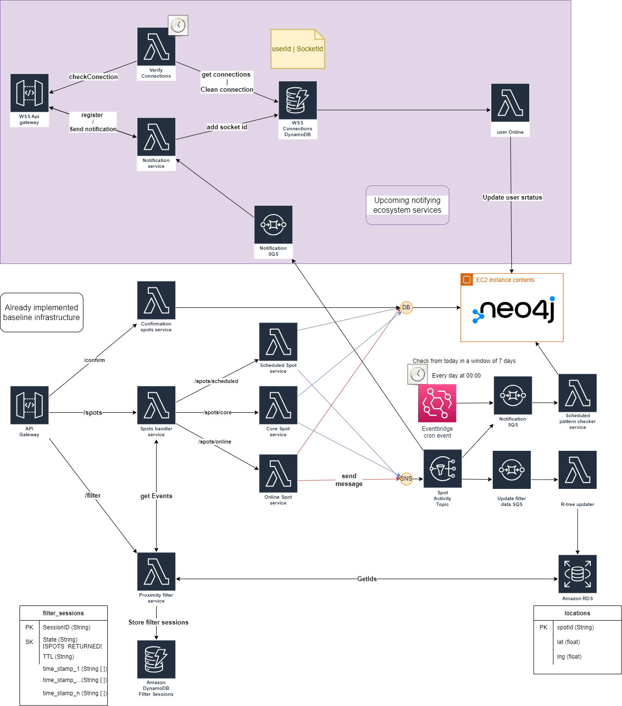
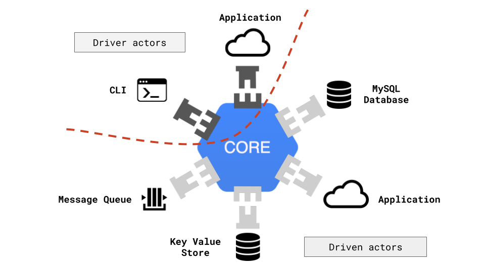

# Now Inc!


## WTF is this?

This is a Github repo, thanks for your attention... Hell no, being simple this is another but interesting application for events, the idea behind this was born when I faced a lot of time the frustration to be in my city without knowing what to do, but realizing that next to my home was a party in a coffee shop, and the next day a public event in a park close to my house, etc... there are so many events that are not too big/planned to be an official event on a page to buy a ticket but those ones are small events where you can find and discover the city that is behind you, just imagine how many events are happening right now in your city that you could just simply go there and have fun, a reading club; a Housewarming party; a public event for bike riders and so on, this kinds of events are the life of the city but they are hidden and that is what Now inc is about, making the life of the city within everyone reach.


### Project architecture




## How is the project structure?

We are going as Microservices, each microservice is being built using a hexagonal architecture, for the frontend we are doing it as a monolithic, you could find more info about each one in their folders (What folders?)

### Folder's structure.

**/front** -> Here you can find all related to the front end.

**/infra** -> Here you can find all related to the infrastructure.

**/services** -> Here you can find all related to the backend services.


Taken from https://medium.com/@matiasvarela/hexagonal-architecture-in-go-cfd4e436faa3

### The development Stack!

We are only using one single language for each section so far.

**Backed** 
```
go version go1.18 darwin/amd64
```

**frontend** 
```
Flutter 2.10.4 • channel stable • https://github.com/flutter/flutter.git
Framework • revision c860cba910 (8 weeks ago) • 2022-03-25 00:23:12 -0500
Engine • revision 57d3bac3dd
Tools • Dart 2.16.2 • DevTools 2.9.2
```

**infra**

* All in AWS, IaaC using AWS CDK.

### CI/CD

Right now the project has only one environment (stage/test), this one is being updated automatically by the GitHub action that the project has configured in the .github folder, so all the backend services are automatically updated. The front end and the infrastructure are not automated.

## How can I help?

Well, right now there is a lot to do, if you want to help just pick an issue from the [list](https://github.com/JuanGQCadavid/now-project/issues), now if you want to help to reach our weekly goals you could select one from the current sprint [here in the milestones](https://github.com/JuanGQCadavid/now-project/milestones). please feel free to contact me if you wish, I'm Juan Gonzalo Quiroz Cadavid and we can get in touch directly by GitHub, by email (jquirozcadavid@gmail.com), or by discord! (jquirozcadavid#6885, jquirozcadavid ).